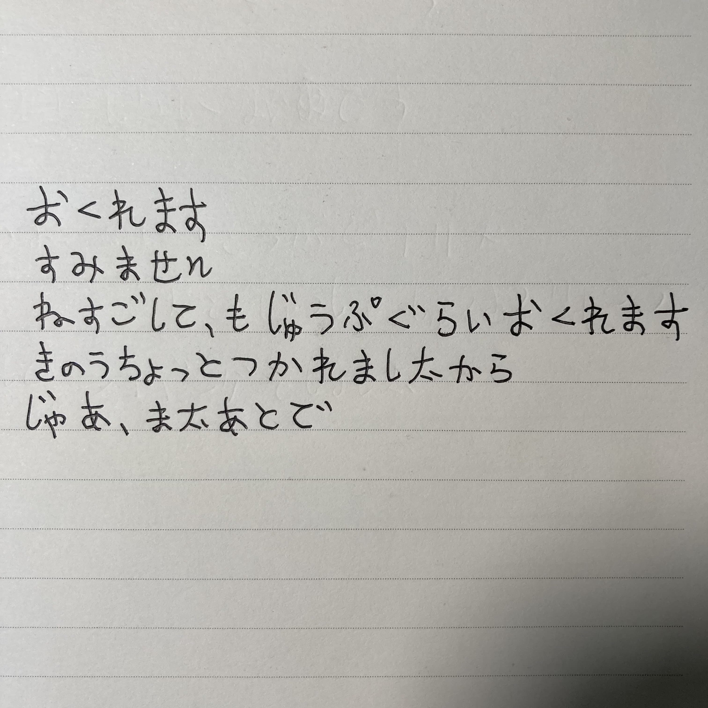
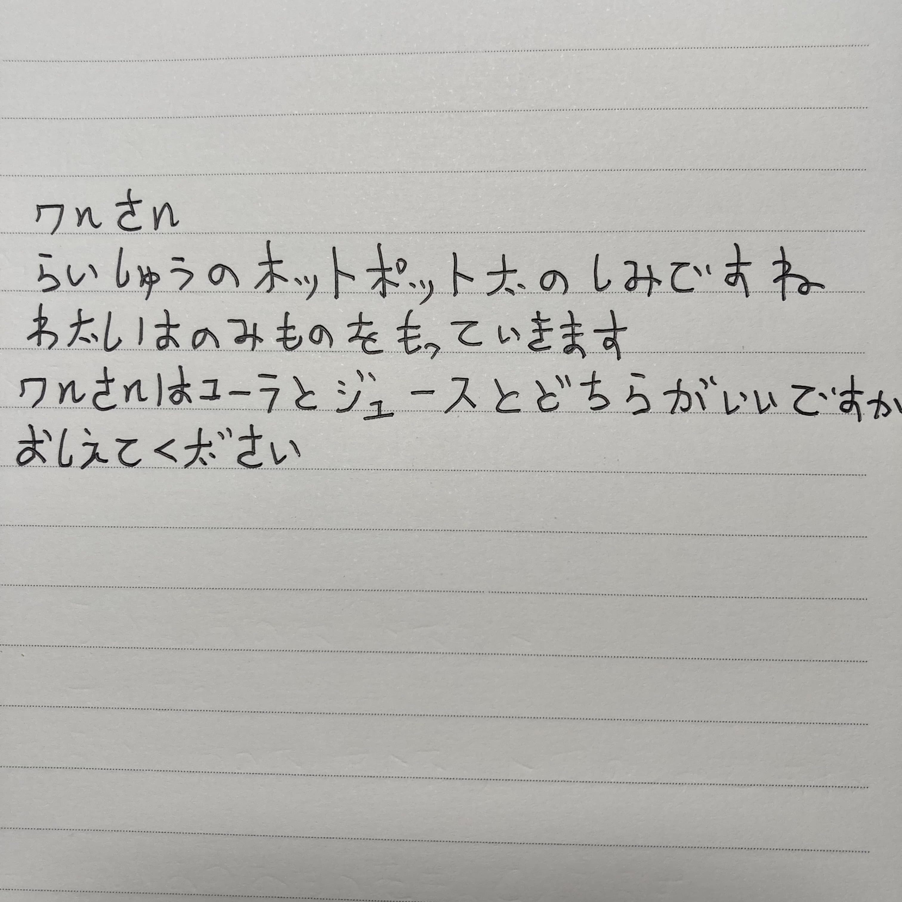
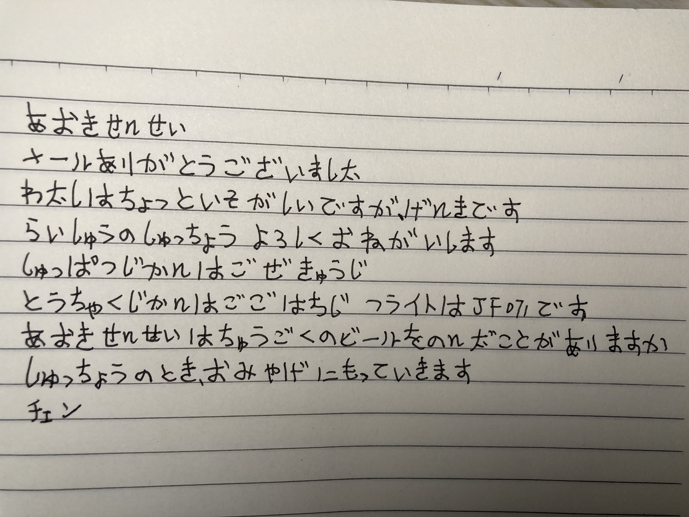
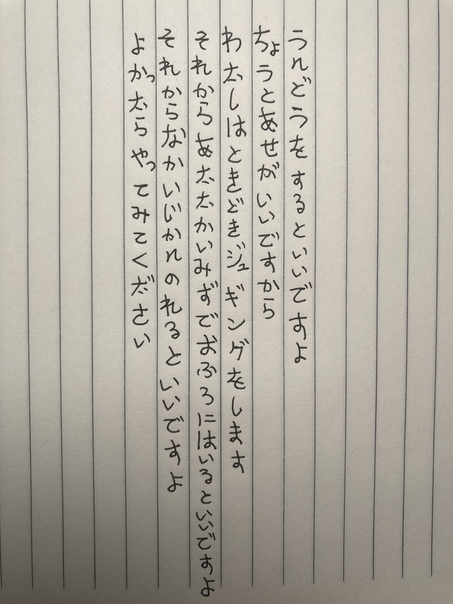
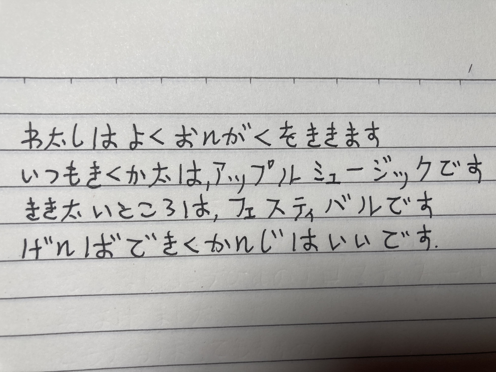

## 2022-07-01 遅れます

すみません

ねすごして、十分ぐらい遅れます

昨日ちょっと疲れましたから

じゃあ、また後で

## 2022-07-10 私の外国語

私は仕事がない時、日本語を勉強しています

日本語は中国語と違います

日本語はカタカナの単語を書くのが難しいです

でも日本語の漢字は簡単です

## 2022-07-13 来週の食事

ワンさん

来週の鍋（なべ）パーティー楽しみですね

私は飲みものを持って行きます

ワンさんはコーラとジュースとどちらでがいいですか

教えてください

## 2022-07-19 出張

青木先生

メールありがとうございました

私はちょっと忙しいですが、元気です

来週の出張よろしく御願いします

出発時間は午前九時、到着時間は午後八時、フライトはJF071です

青木先生は中国のビールを飲んだことがありますか

出張の時、お土産に持って行きます

チェン

## 2022-07-22 健康の相談

運動をするといいですよ

ちょうと汗をかくのがいいですから

私は時々ジョギングをします

それから温かいお風呂に入るといいですよ

それから長い時間寝るといいですよ

良かったらやってみてください

## 2022-07-29 私の趣味

私はよく音楽を聞きます

いつもアップルミュージックで聞いています

フェスティバルに行って、生で音楽を聞いてみたいです

