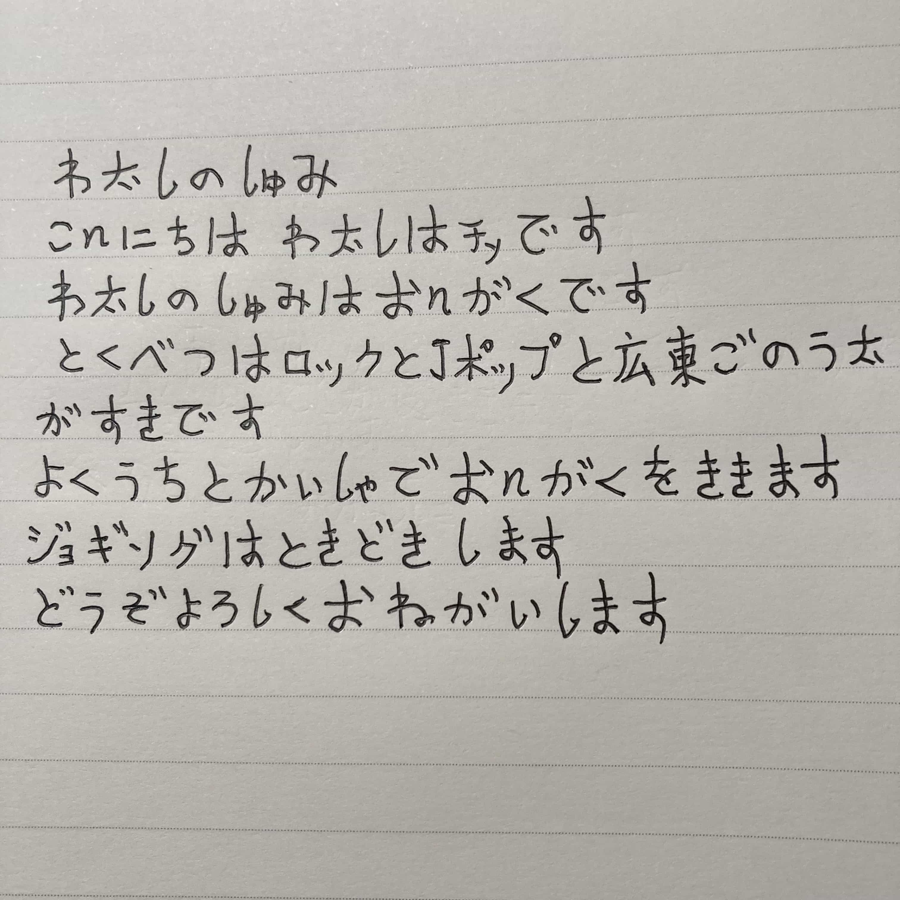
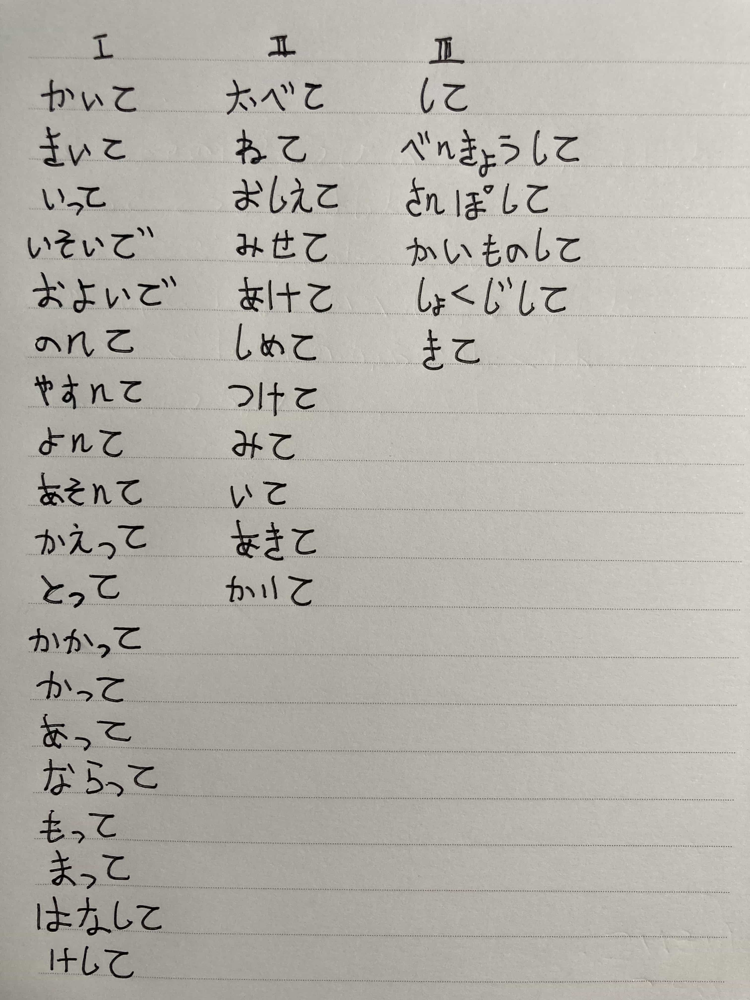

## 2022-06-01 私の趣味

私の趣味

こんにちは、私はチェです

私の趣味は音楽です

とくにロックとJポップと広東ごの歌が好きです

よくうちと会社で音楽を聴きます

ジョギングは時々します

どうぞよろしくお願いします

## 2022-06-06 うちから実家(じっか)まで

うちから実家まで

私はうちがらビンカン駅まで歩いて行きます

ビンカン駅からこうじゅう東駅まで地下鉄で行きます

こうじゅう東駅で高速鉄道に乗ります

ドンタイ駅で高速鉄道をおります

ドンタイ駅から実家までバスで行きます

うちから実家まで五時間です

## 2022-06-09 先月の買い物

私は先月買い物に行きました

インタネットでパンとストックを買いました

インタネットで牛乳とスキンケア商品を買いました

母にあげました

## 2022-06-16 休みの日

先週の日曜日の午前うちにしました

うちで掃除をしました

そして午後会社に行きました

会社で日本語が勉強しました

会社で勉強すると、私はもっと集中（しゅうちゅう）できます。

## 2022-06-20 て形の作り方

## 2022-06-22 私の家族

私の家族

家族は四人です

父と母と祖父と私です

父の仕事は建設労働者です

建築会社で働いています

建築会社にでんどうじてんしゃで行きます

## 2022-06-27 好きな季節

好きな季節

こうしゅうには季節が四つあります

春、夏、秋、冬です

私は暖かいのが好きですから、春が好きです

でも暑いのは好きじゃないですから、夏は好きじゃないです

春は三月から五月ごろです

夏は六月から九月ごろです

## 2022-06-30 私の町

私の街

ここは飛来峰です

近いはれいいんじやせいこなどがあります

綺麗で人気があります

ぜひ行ってみてください

