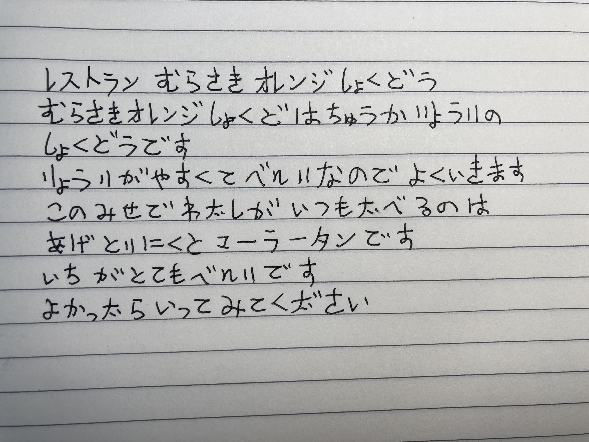
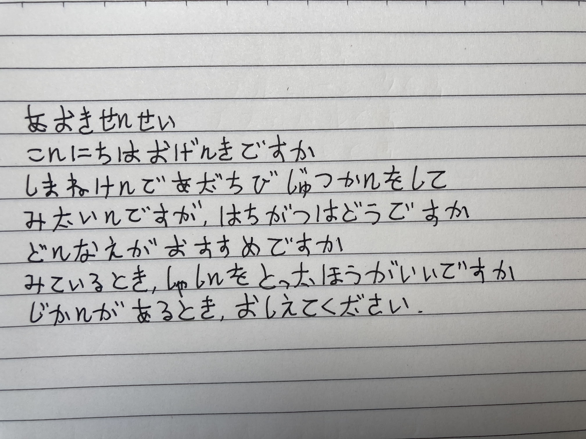
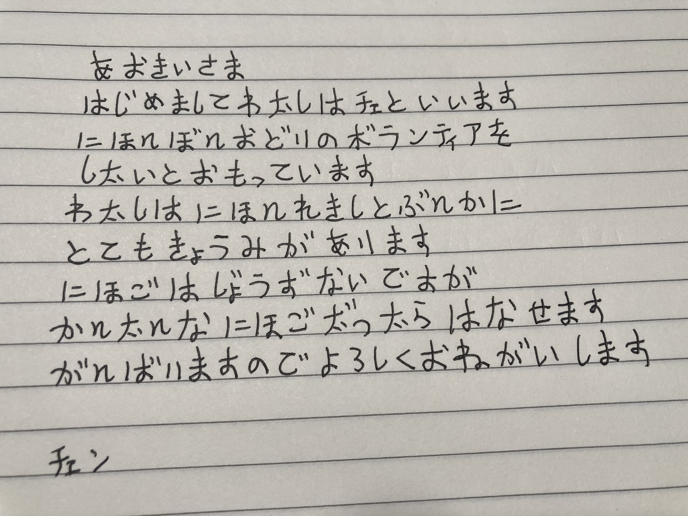
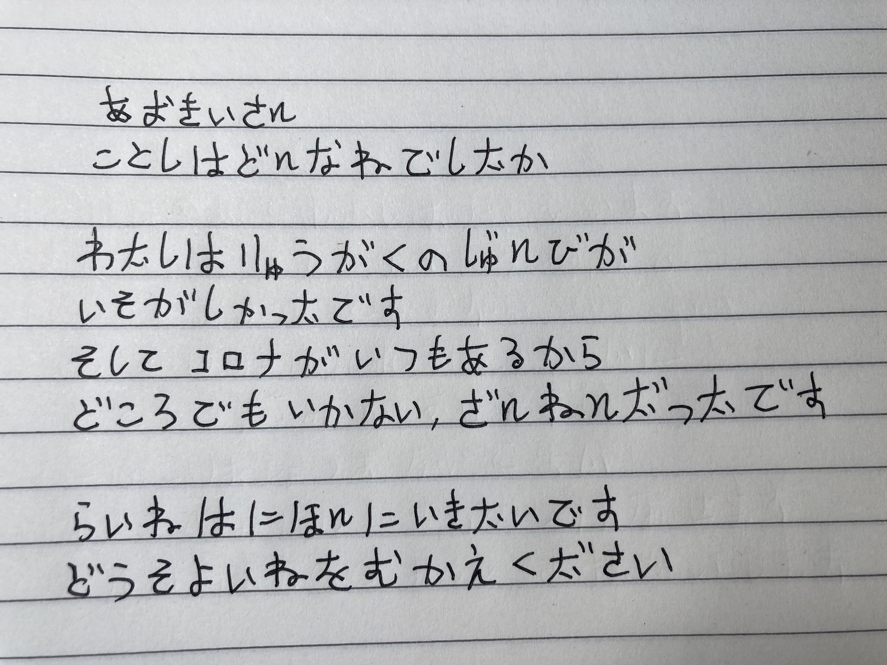

## 2022-08-04 おすすめのレストラン

レストラン紫オレンジ食堂

紫オレンジ食堂は中華料理の食堂です

料理が安くて、便利なのでよく行きます

この店で私がいつも食べるのはとりの唐揚（からあ）げとマーラータンです

この店は、とても便利なところにあります

やかったら行ってみてください

## 2022-08-08 旅行についての質問

青木先生

こんにちはお元気ですか

島根県で足立美術館にいてみたいんですが、八月はどうですか

どんなえがおすすめですか

みているとき、写真を撮った方がいいですか

時間がある時、教えてください

## 2022-08-11 ボランテイアのもうしこみ

青木さま

初めまして私はチェンと言います

にほんぼん踊りのボランテイアをしたいと思っています

私は日本の歴史と文化にとても興味があります

日本語は上手ないですが、かんたんな日本語だったらはなせます

がんばりますのでよろしくおねがいします

## 2022-08-18 季節のお祝い

青木さん

今年はどんな年でしたか

私は留学の準備が忙しかったです

そしてコロナがいつもあるから、どこへも行けなくて、残念でした

来年は日本に行きたいです

どうそよいねをむかえください

