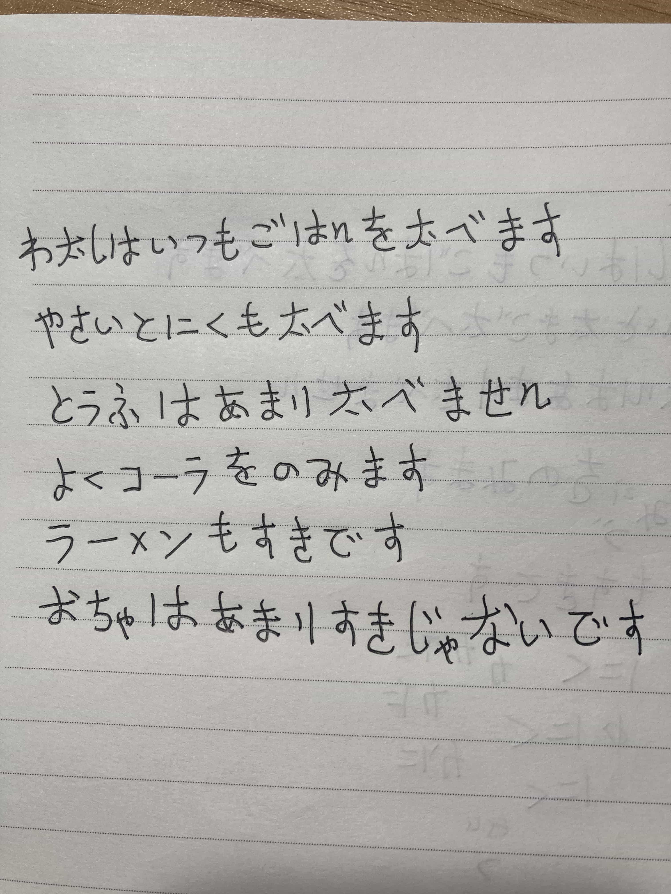
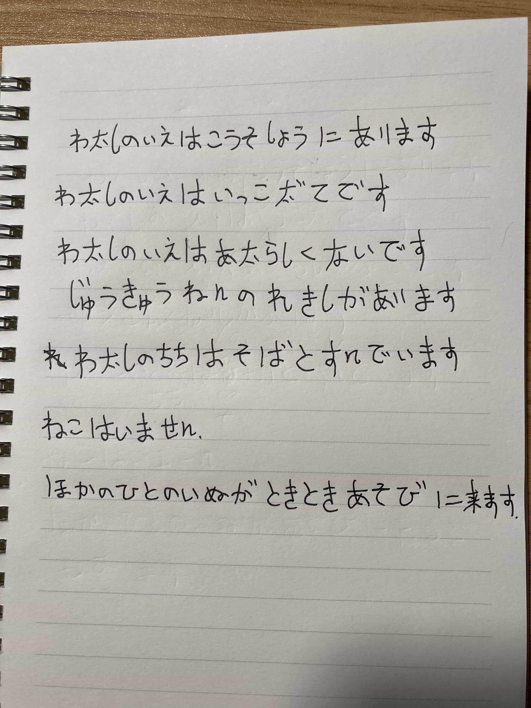
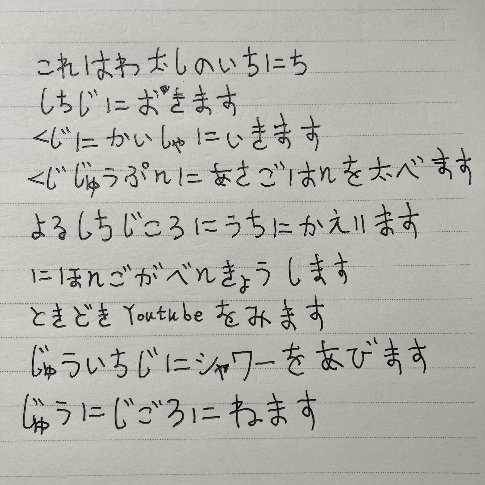

## 2022-05-16 私の朝ごはん

私はいつもごはんを食べます。

野菜と肉も食べます。

豆腐はあまり食べせん。

よくコーラを飲みます。

お茶はあまりすきじゃないです。

## 2022-05-23 私の家

私の家は江蘇省あります。

私の家は一戸建てです。

私の家は新しくないです、じゅうきゅうねんの歴史があります。

私の父は祖父とすんでいます。

猫はいません。ほかの人の犬が時々遊びに来ます。

## 2022-05-28 私の一日

これは私の一日

七時に起きます。

九時に会社に行きます。

九時十分に朝ご飯を食べます。

夜七時ごろうちに帰ります。

日本語を勉強します。

時々ユーチューブを見ます。

十一時にシャワーを浴びます。

十二時ごろ寝ます。

